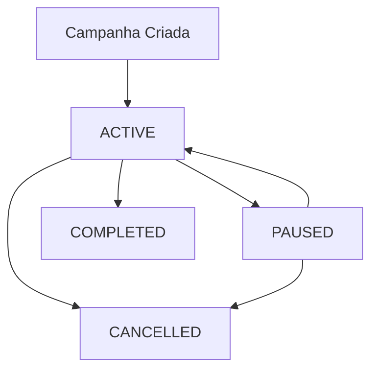

# Pausar Campanha

Pausa uma campanha que está atualmente em execução. A campanha pode ser retomada posteriormente.

<Note>
  Você precisa de um access token válido no header `X-Access-Token` para usar este endpoint.
</Note>

## Endpoint

```http
PUT /api/campaigns/{id}/pause
```

## Parâmetros da URL

<ParamField body="id" type="number" required={true}>
  ID único da campanha que deseja pausar.
</ParamField>

## Headers

| Header | Tipo | Obrigatório | Descrição |
|--------|------|-------------|-----------|
| `X-Access-Token` | string | Sim | Token de acesso obtido no registro |

## Exemplo de Request

```bash
curl -X PUT https://api.disparador.com/api/campaigns/1/pause \
  -H "X-Access-Token: eyJhbGciOiJIUzI1NiIsInR5cCI6IkpXVCJ9..."
```

## Response

### Sucesso (200 OK)

```json
{
  "id": 1,
  "name": "Campanha de Boas-vindas",
  "status": "PAUSED",
  "totalContacts": 2,
  "sentMessages": 1,
  "failedMessages": 0,
  "createdAt": "2024-01-15T10:30:00",
  "message": null
}
```

### Erro (400 Bad Request)

```json
{
  "id": null,
  "name": null,
  "status": null,
  "totalContacts": 0,
  "sentMessages": 0,
  "failedMessages": 0,
  "message": "Campanha não pode ser pausada"
}
```

## Campos da Resposta

| Campo | Tipo | Descrição |
|-------|------|-----------|
| `id` | number | ID único da campanha |
| `name` | string | Nome da campanha |
| `status` | string | Status atualizado: PAUSED |
| `totalContacts` | number | Total de contatos na campanha |
| `sentMessages` | number | Mensagens enviadas com sucesso |
| `failedMessages` | number | Mensagens que falharam |
| `createdAt` | datetime | Data e hora de criação |
| `message` | string | Mensagem de erro (null em caso de sucesso) |

## Códigos de Erro

| Código | Descrição |
|--------|-----------|
| `400` | Access token inválido, campanha não encontrada ou não pode ser pausada |
| `500` | Erro interno do servidor |

## Quando uma campanha pode ser pausada

Uma campanha pode ser pausada apenas se estiver no status `ACTIVE`. Campanhas nos seguintes status **não podem** ser pausadas:

- `PAUSED` - Já está pausada
- `CANCELLED` - Já foi cancelada
- `COMPLETED` - Já foi finalizada

## Exemplos de Uso

### JavaScript

```javascript
const campaignId = 1;
const response = await fetch(`https://api.disparador.com/api/campaigns/${campaignId}/pause`, {
  method: 'PUT',
  headers: {
    'X-Access-Token': 'seu-access-token'
  }
});

const result = await response.json();
console.log('Resultado:', result);
```

### Python

```python
import requests

campaign_id = 1
headers = {
    'X-Access-Token': 'seu-access-token'
}

response = requests.put(f'https://api.disparador.com/api/campaigns/{campaign_id}/pause', headers=headers)
result = response.json()
print('Resultado:', result)
```

### PHP

```php
$campaign_id = 1;
$headers = [
    'X-Access-Token: seu-access-token'
];

$response = file_get_contents("https://api.disparador.com/api/campaigns/{$campaign_id}/pause", false, stream_context_create([
    'http' => [
        'method' => 'PUT',
        'header' => implode("\r\n", $headers)
    ]
]));

$result = json_decode($response, true);
echo 'Resultado: ' . print_r($result, true);
```

## Fluxo de Gerenciamento



## Exemplos de Erro

### Campanha já pausada
```json
{
  "id": null,
  "name": null,
  "status": null,
  "totalContacts": 0,
  "sentMessages": 0,
  "failedMessages": 0,
  "message": "Campanha já está pausada"
}
```

### Campanha finalizada
```json
{
  "id": null,
  "name": null,
  "status": null,
  "totalContacts": 0,
  "sentMessages": 0,
  "failedMessages": 0,
  "message": "Campanha já foi finalizada"
}
```

### Campanha não encontrada
```json
{
  "id": null,
  "name": null,
  "status": null,
  "totalContacts": 0,
  "sentMessages": 0,
  "failedMessages": 0,
  "message": "Campanha não encontrada"
}
```

## Próximos Passos

Após pausar a campanha:

1. [Retomar Campanha](/api-reference/campaigns/resume) - Retome a campanha pausada
2. [Cancelar Campanha](/api-reference/campaigns/cancel) - Cancele a campanha
3. [Consultar Status](/api-reference/campaigns/get) - Verifique o status atual
4. [Listar Campanhas](/api-reference/campaigns/list) - Veja todas as campanhas 