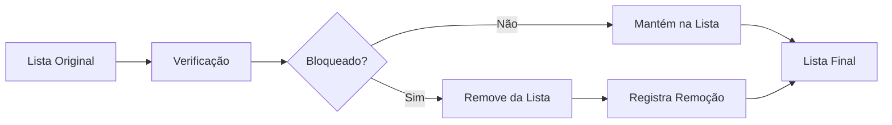

## Visão Geral

O Bloqueio Inteligente é um sistema completo para gerenciar contatos que não devem receber mensagens. Essencial para:

<CardGroup cols={2}>
  <Card title="Conformidade Legal" icon="shield-check" color="#16a34a">
    Respeitar LGPD, opt-outs e requisitos regulatórios
  </Card>
  <Card title="Qualidade de Comunicação" icon="sparkles" color="#3b82f6">
    Evitar envio para números inválidos ou desativados
  </Card>
  <Card title="Proteção de Reputação" icon="star" color="#f59e0b">
    Manter boa reputação com WhatsApp Business
  </Card>
  <Card title="Economia de Recursos" icon="piggy-bank" color="#8b5cf6">
    Não desperdiçar mensagens com contatos não receptivos
  </Card>
</CardGroup>

## Como Funciona

### 1. Métodos de Bloqueio

<CardGroup cols={3}>
  <Card title="Individual" icon="user-x">
    Bloquear um único número através da API ou interface web
  </Card>
  <Card title="Importação em Massa" icon="file-import">
    Importar CSV com até 1000 números por vez
  </Card>
  <Card title="Banco de Dados" icon="database">
    Importar direto de bancos PostgreSQL configurados
  </Card>
</CardGroup>

### 2. Filtro Automático

<Note>
O filtro é aplicado **automaticamente** em TODAS as campanhas, sem necessidade de configuração adicional.
</Note>

**Processo de filtragem:**



### 3. Normalização Inteligente

Todos os números são normalizados automaticamente:

| Entrada | Saída Normalizada |
|---------|-------------------|
| `(11) 99999-9999` | `5511999999999` |
| `011 99999-9999` | `5511999999999` |
| `+55 11 99999-9999` | `5511999999999` |
| `11999999999` | `5511999999999` |
| `999999999` | `5511999999999` |

**Regras de normalização:**
- Remove caracteres especiais: `()-. `
- Remove zeros à esquerda
- Adiciona código do país (55) quando ausente
- Adiciona código de área quando detectável
- Padroniza para formato E.164

## Interface Web

### Acesso

<Steps>
  <Step title="Navegue para Configurações">
    Acesse o menu Configurações no painel lateral
  </Step>
  <Step title="Clique em Bloqueio Inteligente">
    Selecione "Gerenciar Contatos Bloqueados"
  </Step>
  <Step title="Gerencie sua lista">
    Adicione, remova ou importe contatos
  </Step>
</Steps>

### Funcionalidades

<CardGroup cols={2}>
  <Card title="Adicionar Individual" icon="plus">
    Digite o número e motivo do bloqueio
  </Card>
  <Card title="Importar CSV" icon="upload">
    Faça upload de arquivo com múltiplos números
  </Card>
  <Card title="Buscar Contato" icon="search">
    Pesquise números específicos na lista
  </Card>
  <Card title="Desbloquear" icon="unlock">
    Remova contatos da lista de bloqueio
  </Card>
</CardGroup>

## Integração com Bancos de Dados

### Configuração

1. Configure um banco PostgreSQL no painel Super Admin
2. Defina a query SQL que retorna números bloqueados
3. Use na importação de contatos bloqueados

### Exemplo de Query

```sql
-- Query deve retornar coluna 'phone' ou 'phoneNumber'
SELECT 
    telefone as phone,
    'Opt-out via sistema' as reason
FROM 
    clientes
WHERE 
    optout = true
    AND telefone IS NOT NULL
```

### Mapeamento de Colunas

| Coluna SQL | Campo no Sistema |
|------------|------------------|
| `phone` ou `phoneNumber` | Número do telefone |
| `reason` (opcional) | Motivo do bloqueio |
| `name` (opcional) | Nome do contato |

## API Reference

### Bloquear Contato Individual

```http
POST /api/blocked-contacts
```

<CodeGroup>

```bash cURL
curl -X POST https://api.exemplo.com/api/blocked-contacts \
  -H "X-Access-Token: seu-token" \
  -H "Content-Type: application/json" \
  -d '{
    "phoneNumber": "11999999999",
    "reason": "Solicitou opt-out via WhatsApp"
  }'
```

```javascript JavaScript
const response = await fetch('https://api.exemplo.com/api/blocked-contacts', {
  method: 'POST',
  headers: {
    'X-Access-Token': 'seu-token',
    'Content-Type': 'application/json'
  },
  body: JSON.stringify({
    phoneNumber: '11999999999',
    reason: 'Solicitou opt-out via WhatsApp'
  })
});
```

</CodeGroup>

### Importar em Massa

```http
POST /api/blocked-contacts/import
```

<CodeGroup>

```javascript JavaScript
const contatos = [
  { phoneNumber: '11999999999', reason: 'Lista opt-out mensal' },
  { phoneNumber: '11888888888', reason: 'Número inválido' }
];

const response = await fetch('https://api.exemplo.com/api/blocked-contacts/import', {
  method: 'POST',
  headers: {
    'X-Access-Token': 'seu-token',
    'Content-Type': 'application/json'
  },
  body: JSON.stringify(contatos)
});
```

</CodeGroup>

### Verificar Múltiplos Contatos

```http
POST /api/blocked-contacts/check
```

<CodeGroup>

```javascript JavaScript
const numeros = ['11999999999', '11888888888', '11777777777'];

const response = await fetch('https://api.exemplo.com/api/blocked-contacts/check', {
  method: 'POST',
  headers: {
    'X-Access-Token': 'seu-token',
    'Content-Type': 'application/json'
  },
  body: JSON.stringify({ phoneNumbers: numeros })
});

// Resposta
{
  "11999999999": true,   // bloqueado
  "11888888888": false,  // não bloqueado
  "11777777777": true    // bloqueado
}
```

</CodeGroup>

## Restrições por Empresa

<Warning>
A funcionalidade de Bloqueio Inteligente pode ser desabilitada por empresa através do painel Super Admin.
</Warning>

Quando desabilitada:
- O botão fica inativo na interface
- A API continua funcionando
- Mensagem informativa é exibida
- Contatos NÃO são filtrados automaticamente

## Boas Práticas

### 1. Sempre Documente o Motivo

<CodeGroup>
```javascript ✅ Recomendado
{
  phoneNumber: "11999999999",
  reason: "Opt-out via email em 15/01/2024 - Ticket #12345"
}
```

```javascript ❌ Evitar
{
  phoneNumber: "11999999999"
  // Sem motivo documentado
}
```
</CodeGroup>

### 2. Use Importação em Massa

<CodeGroup>
```javascript ✅ Eficiente
// Uma única requisição para múltiplos contatos
await api.importBlockedContacts(listaDeContatos);
```

```javascript ❌ Ineficiente
// Múltiplas requisições individuais
for (const contato of listaDeContatos) {
  await api.blockContact(contato);
}
```
</CodeGroup>

### 3. Valide Antes de Grandes Campanhas

```javascript
// Verificar impacto antes de criar campanha
const verificacao = await api.checkBlockedContacts(contatosCampanha);
const bloqueados = Object.values(verificacao).filter(b => b).length;

console.log(`${bloqueados} de ${contatosCampanha.length} serão filtrados`);
```

## Performance e Limites

<CardGroup cols={3}>
  <Card title="Importação" icon="upload">
    Máximo 1000 números por requisição
  </Card>
  <Card title="Lista Total" icon="database">
    Sem limite de contatos bloqueados
  </Card>
  <Card title="Verificação" icon="search">
    Recomendado lotes de 1000
  </Card>
</CardGroup>

### Otimizações

- **Cache inteligente** para verificações frequentes
- **Índices otimizados** no banco de dados
- **Queries em batch** para melhor performance
- **Suporta milhões** de registros por empresa

## Histórico e Auditoria

### Informações Registradas

Cada ação de bloqueio/desbloqueio registra:

| Campo | Descrição |
|-------|-----------|
| `blockedBy` | Email do usuário que executou |
| `blockedAt` | Data e hora do bloqueio |
| `unblockedAt` | Data e hora do desbloqueio |
| `reason` | Motivo fornecido |
| `source` | Origem (API, Web, Import) |

### Soft Delete

- Contatos desbloqueados não são deletados
- Histórico completo é preservado
- Possível reativar bloqueios anteriores
- Auditoria completa disponível

## Integração com Campanhas

### Resposta ao Criar Campanha

```json
{
  "id": 123,
  "name": "Campanha de Janeiro",
  "status": "SCHEDULED",
  "totalContacts": 950,           // Apenas contatos válidos
  "blockedContactsRemoved": 50,   // Quantidade filtrada
  "createdAt": "2024-01-15T10:00:00Z"
}
```

### Transparência Total

- Número original é sempre informado
- Quantidade filtrada é destacada
- Lista de bloqueados pode ser consultada
- Logs detalham todo o processo

## FAQ

<AccordionGroup>
  <Accordion title="Posso desbloquear um contato?">
    Sim, através da interface web em Configurações > Bloqueio Inteligente ou via API com DELETE `/api/blocked-contacts/{phoneNumber}`.
  </Accordion>
  
  <Accordion title="O bloqueio é retroativo para campanhas em andamento?">
    Não, apenas campanhas criadas APÓS o bloqueio serão afetadas. Campanhas em execução continuam normalmente.
  </Accordion>
  
  <Accordion title="Há limite de contatos bloqueados por empresa?">
    Não há limite técnico. O sistema foi otimizado para suportar milhões de registros por empresa.
  </Accordion>
  
  <Accordion title="Como importar de um banco de dados?">
    Configure o banco no painel Super Admin, crie uma query que retorne os números, e use a opção de importação do banco.
  </Accordion>
  
  <Accordion title="O bloqueio funciona entre empresas diferentes?">
    Não, cada empresa tem sua lista independente. Um número bloqueado na empresa A pode receber mensagens da empresa B.
  </Accordion>
</AccordionGroup>

## Próximos Passos

<CardGroup cols={3}>
  <Card title="API Reference" icon="code" href="/api-reference/blocked-contacts/list">
    Documentação completa da API
  </Card>
  <Card title="Interface Web" icon="browser" href="/frontend/settings/blocked-contacts">
    Guia da interface web
  </Card>
  <Card title="Super Admin" icon="shield" href="/frontend/settings#super-admin">
    Configurar restrições
  </Card>
</CardGroup>