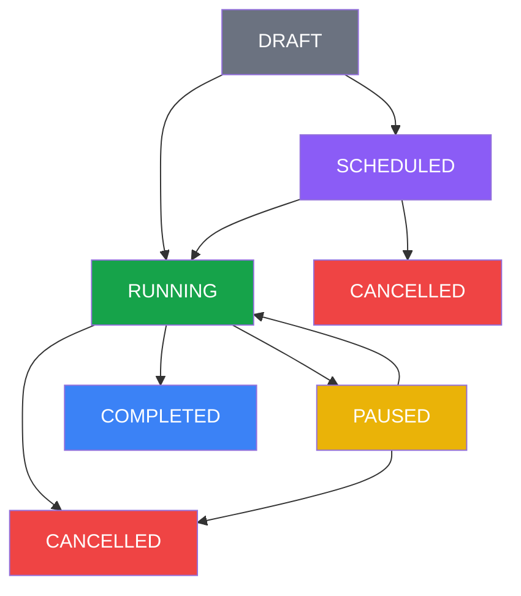

<Note>
Esta página descreve todos os status possíveis para campanhas, incluindo transições válidas e comportamentos esperados.
</Note>

## Status de Campanha

As campanhas possuem 6 status principais que representam seu ciclo de vida:

<CardGroup cols={2}>
  <Card title="DRAFT" icon="file-text" color="#6b7280">
    **Rascunho** - Campanha criada mas ainda não iniciada
  </Card>
  <Card title="SCHEDULED" icon="clock" color="#8b5cf6">
    **Agendada** - Campanha programada para execução futura
  </Card>
  <Card title="RUNNING" icon="play" color="#16a34a">
    **Em Execução** - Campanha enviando mensagens ativamente
  </Card>
  <Card title="PAUSED" icon="pause" color="#eab308">
    **Pausada** - Campanha temporariamente suspensa
  </Card>
  <Card title="COMPLETED" icon="check-circle" color="#3b82f6">
    **Concluída** - Todas as mensagens foram processadas
  </Card>
  <Card title="CANCELLED" icon="x-circle" color="#ef4444">
    **Cancelada** - Campanha interrompida permanentemente
  </Card>
</CardGroup>

## Fluxo de Status

### Diagrama de Transições



## Regras de Transição

### ✅ Transições Permitidas

| Status Atual | Status Destino | Ação/Trigger | Condições |
|--------------|----------------|--------------|-----------|
| DRAFT | RUNNING | Criar sem agendamento | Execução imediata |
| DRAFT | SCHEDULED | Criar com agendamento | Data futura definida |
| SCHEDULED | RUNNING | Automático | Horário agendado chegou |
| SCHEDULED | CANCELLED | Cancelar | Antes da execução |
| RUNNING | PAUSED | Pausar | A qualquer momento |
| RUNNING | COMPLETED | Automático | Todas mensagens enviadas |
| RUNNING | CANCELLED | Cancelar | A qualquer momento |
| PAUSED | RUNNING | Retomar | Dentro do prazo |
| PAUSED | CANCELLED | Cancelar | A qualquer momento |

### ❌ Transições Não Permitidas

| Status Atual | Status Destino | Motivo |
|--------------|----------------|---------|
| COMPLETED | Qualquer | Campanha já finalizada |
| CANCELLED | Qualquer | Campanha cancelada permanentemente |
| DRAFT | PAUSED | Não pode pausar antes de iniciar |
| SCHEDULED | PAUSED | Não pode pausar campanha agendada |
| PAUSED | SCHEDULED | Não pode reagendar campanha pausada |

## Comportamentos por Status

### DRAFT (Rascunho)

<div className="bg-gray-50 dark:bg-gray-800 p-4 rounded-lg">
  <div className="font-semibold mb-2">Características</div>
  
  - Status inicial de toda campanha criada com `isDraft: true`
  - Nenhuma mensagem enviada
  - Pode ser iniciada imediatamente ou agendada
  - Configurações podem ser alteradas livremente
  - Sem limite de tempo neste status
</div>

**Campos importantes:**
- `createdAt`: Data de criação
- `sentCount`: Sempre 0
- `status`: "DRAFT"
- `totalContacts`: Número de contatos definidos

### SCHEDULED (Agendada)

<div className="bg-purple-50 dark:bg-purple-900/20 p-4 rounded-lg">
  <div className="font-semibold mb-2">Características</div>
  
  - Campanha aguardando horário programado
  - Worker verifica a cada minuto por campanhas prontas
  - Inicia automaticamente no horário definido
  - Pode ser cancelada antes do início
  - Notificação enviada quando inicia (se configurado)
</div>

**Campos importantes:**
- `scheduledFor`: Data/hora programada
- `status`: "SCHEDULED"
- `sentCount`: Sempre 0
- `message`: Pode estar vazio se for enquete

### RUNNING (Em Execução)

<div className="bg-green-50 dark:bg-green-900/20 p-4 rounded-lg">
  <div className="font-semibold mb-2">Características</div>
  
  - Enviando mensagens ativamente
  - Respeita intervalos configurados
  - Atualiza contadores em tempo real
  - Pode ser pausada ou cancelada
  - Remove automaticamente contatos bloqueados
</div>

**Campos importantes:**
- `startedAt`: Momento do início real
- `sentCount`: Incrementado a cada envio
- `failedCount`: Contador de falhas
- `status`: "RUNNING"
- `progress`: Percentual calculado

### PAUSED (Pausada)

<div className="bg-yellow-50 dark:bg-yellow-900/20 p-4 rounded-lg">
  <div className="font-semibold mb-2">Características</div>
  
  - Interrupção temporária do envio
  - Mantém posição na fila de contatos
  - Pode ser retomada ou cancelada
  - Tempo máximo de pausa configurável
  - Estado preservado para continuação
</div>

**Campos importantes:**
- `pausedAt`: Momento da pausa
- `sentCount`: Congelado no valor atual
- `status`: "PAUSED"
- `remainingContacts`: Calculado dinamicamente

<Warning>
Por padrão, campanhas pausadas há mais de 24 horas são canceladas automaticamente.
</Warning>

### COMPLETED (Concluída)

<div className="bg-blue-50 dark:bg-blue-900/20 p-4 rounded-lg">
  <div className="font-semibold mb-2">Características</div>
  
  - Todos os contatos foram processados
  - Status final bem-sucedido
  - Não pode ser modificada
  - Estatísticas finais disponíveis
  - Notificação de conclusão enviada (se configurado)
</div>

**Campos importantes:**
- `completedAt`: Momento da conclusão
- `sentCount`: Total de enviados com sucesso
- `failedCount`: Total de falhas
- `duration`: Tempo total de execução

### CANCELLED (Cancelada)

<div className="bg-red-50 dark:bg-red-900/20 p-4 rounded-lg">
  <div className="font-semibold mb-2">Características</div>
  
  - Interrupção permanente
  - Não pode ser retomada
  - Mantém histórico parcial
  - Libera recursos do sistema
  - Registra motivo do cancelamento
</div>

**Campos importantes:**
- `cancelledAt`: Momento do cancelamento
- `cancelledBy`: Usuário ou sistema
- `sentCount`: Mensagens enviadas antes do cancelamento
- `reason`: Motivo (manual, timeout, erro)

## Campos de Controle

### Timestamps

```typescript
interface CampaignTimestamps {
  createdAt: Date;         // Criação da campanha
  scheduledFor?: Date;     // Agendamento (se aplicável)
  startedAt?: Date;        // Início real da execução
  pausedAt?: Date;         // Última pausa
  resumedAt?: Date;        // Última retomada
  completedAt?: Date;      // Conclusão
  cancelledAt?: Date;      // Cancelamento
  updatedAt: Date;         // Última modificação
}
```

### Contadores

```typescript
interface CampaignCounters {
  totalContacts: number;         // Total de contatos
  sentCount: number;             // Mensagens enviadas
  failedCount: number;           // Falhas de envio
  blockedContactsRemoved: number; // Removidos por bloqueio
  progress: number;              // Percentual (0-100)
}
```

## API de Transições

### Pausar Campanha

```http
PUT /api/campaigns/{id}/pause
Authorization: Bearer {token}
```

**Pré-condições:**
- Status atual: RUNNING
- Campanha pertence à empresa do token

**Resposta:**
```json
{
  "success": true,
  "data": {
    "id": 123,
    "status": "PAUSED",
    "pausedAt": "2024-01-16T10:30:00Z",
    "sentCount": 500,
    "totalContacts": 1000
  }
}
```

### Retomar Campanha

```http
PUT /api/campaigns/{id}/resume
Authorization: Bearer {token}
```

**Pré-condições:**
- Status atual: PAUSED
- Dentro do prazo permitido
- Evolution API conectada

**Resposta:**
```json
{
  "success": true,
  "data": {
    "id": 123,
    "status": "RUNNING",
    "resumedAt": "2024-01-16T11:00:00Z"
  }
}
```

### Cancelar Campanha

```http
PUT /api/campaigns/{id}/cancel
Authorization: Bearer {token}
```

**Pré-condições:**
- Status atual: SCHEDULED, RUNNING ou PAUSED
- Campanha pertence à empresa do token

**Resposta:**
```json
{
  "success": true,
  "data": {
    "id": 123,
    "status": "CANCELLED",
    "cancelledAt": "2024-01-16T11:30:00Z",
    "cancelledBy": "user@empresa.com",
    "sentCount": 750
  }
}
```

## Webhooks de Status

### Eventos Disparados

```typescript
interface StatusChangeEvent {
  event: "campaign.status_changed";
  campaignId: number;
  companyId: number;
  previousStatus: string;
  newStatus: string;
  timestamp: string;
  metadata: {
    sentCount?: number;
    failedCount?: number;
    progress?: number;
  };
}
```

### Configuração

Configure URLs de webhook nas configurações da empresa para receber notificações de mudança de status.

## Boas Práticas

<CardGroup cols={2}>
  <Card title="Monitoramento" icon="eye" color="#16a34a">
    Acompanhe campanhas RUNNING regularmente
  </Card>
  <Card title="Timeouts" icon="clock" color="#3b82f6">
    Configure timeouts apropriados para PAUSED
  </Card>
  <Card title="Limpeza" icon="trash" color="#8b5cf6">
    Archive campanhas COMPLETED antigas
  </Card>
  <Card title="Logs" icon="file-text" color="#eab308">
    Mantenha logs de transições para auditoria
  </Card>
</CardGroup>

## Troubleshooting

### Campanha travada em RUNNING

**Possíveis causas:**
1. Worker parado ou com erro
2. Evolution API desconectada
3. Fila Redis congestionada

**Soluções:**
1. Verificar logs do worker
2. Confirmar conexão Evolution
3. Pausar e retomar campanha
4. Reiniciar worker se necessário

### Campanha não inicia no horário agendado

**Possíveis causas:**
1. Fuso horário incorreto
2. Worker não está rodando
3. Campanha foi cancelada

**Soluções:**
1. Verificar configuração de timezone
2. Confirmar worker ativo
3. Verificar logs de sistema

### Status inconsistente

**Possíveis causas:**
1. Modificação manual no banco
2. Erro durante transição
3. Concorrência de processos

**Soluções:**
1. Usar apenas APIs oficiais
2. Verificar logs de erro
3. Implementar locks apropriados

## Referência Rápida

| Status | Cor | Pode Pausar | Pode Cancelar | Pode Retomar | É Final |
|--------|-----|-------------|---------------|--------------|---------|
| DRAFT | Cinza | ❌ | ❌ | ❌ | ❌ |
| SCHEDULED | Roxo | ❌ | ✅ | ❌ | ❌ |
| RUNNING | Verde | ✅ | ✅ | ❌ | ❌ |
| PAUSED | Amarelo | ❌ | ✅ | ✅ | ❌ |
| COMPLETED | Azul | ❌ | ❌ | ❌ | ✅ |
| CANCELLED | Vermelho | ❌ | ❌ | ❌ | ✅ |
