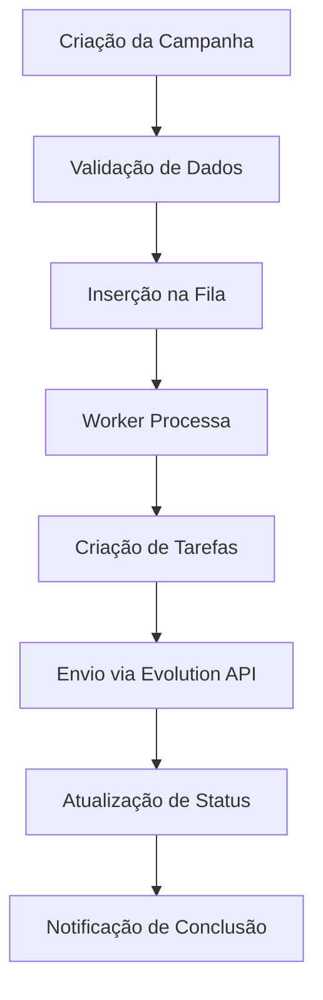

<Note>
Este guia aborda os conceitos fundamentais por trás da API Disparador, explicando como ela se integra com a Evolution API para o envio de mensagens e como nosso sistema de filas garante o processamento eficiente das campanhas.
</Note>

## Visão Geral da Arquitetura

A API Disparador é construída sobre uma arquitetura robusta que combina:

<CardGroup cols={3}>
  <Card title="Spring Boot" icon="server" color="#16a34a">
    Framework Java para APIs REST
  </Card>
  <Card title="Redis" icon="database" color="#dc2626">
    Sistema de filas e cache
  </Card>
  <Card title="Evolution API" icon="message-circle" color="#2563eb">
    Integração com WhatsApp
  </Card>
</CardGroup>

## Evolution API

A **Evolution API** é a espinha dorsal para o envio de mensagens de WhatsApp. Nossa API se integra diretamente com ela para:

<CardGroup cols={2}>
  <Card title="Conectividade" icon="wifi" color="#16a34a">
    Estabelecer e manter a conexão com as instâncias do WhatsApp
  </Card>
  <Card title="Envio de Mensagens" icon="send" color="#2563eb">
    Enviar mensagens de texto, mídias e legendas
  </Card>
  <Card title="Gerenciamento de Instâncias" icon="settings" color="#7c3aed">
    Utilizar evolutionUrl, evolutionApiKey e evolutionInstance
  </Card>
  <Card title="Status de Entrega" icon="check-circle" color="#ea580c">
    Verificar status de entrega das mensagens
  </Card>
</CardGroup>

### Configuração da Evolution API

Para usar a API Disparador, você precisa configurar:

<ParamField body="evolutionUrl" type="string" required>
  URL da sua Evolution API (ex: https://sua-evolution-api.com)
</ParamField>

<ParamField body="evolutionApiKey" type="string" required>
  Sua chave de API da Evolution
</ParamField>

<ParamField body="evolutionInstance" type="string" required>
  Nome da instância do WhatsApp conectada
</ParamField>

<Warning>
Certifique-se de que sua Evolution API está configurada e funcionando antes de usar a API Disparador. Para mais detalhes, consulte a [documentação oficial da Evolution API](https://doc.evolution-api.com/v2/pt/get-started/introduction).
</Warning>

## Sistema de Filas de Mensagens

A API Disparador utiliza um robusto sistema de filas de mensagens para processar e disparar campanhas de forma assíncrona e eficiente.

### Benefícios do Sistema de Filas

<CardGroup cols={2}>
  <Card title="Escalabilidade" icon="trending-up" color="#16a34a">
    Campanhas com grande número de contatos processadas sem sobrecarga
  </Card>
  <Card title="Confiabilidade" icon="shield-check" color="#2563eb">
    Mensagens enfileiradas e retentadas em caso de falha
  </Card>
  <Card title="Agendamento" icon="clock" color="#7c3aed">
    Campanhas agendadas processadas no momento correto
  </Card>
  <Card title="Controle de Fluxo" icon="sliders" color="#ea580c">
    Intervalo controlado entre envios para evitar bloqueios
  </Card>
</CardGroup>

### Como Funciona o Processamento

<RequestExample>



</RequestExample>

#### 1. Criação da Campanha

Ao criar uma campanha via endpoint `POST /api/campaigns`:

- A API valida todos os dados fornecidos
- Verifica a configuração da Evolution API
- Insere a campanha no banco de dados
- Adiciona a campanha à fila de processamento

#### 2. Processamento Assíncrono

Um **worker** (`MessageQueueWorker`) monitora a fila de processamento:

- Detecta novas campanhas automaticamente
- Processa cada campanha individualmente
- Cria tarefas de envio para cada contato
- Gerencia retry automático em caso de falhas

#### 3. Envio de Mensagens

Cada tarefa de envio é processada:

- Respeita intervalos configurados (3-30 segundos)
- Evita limites de taxa da Evolution API
- Processa variáveis personalizadas na mensagem
- Suporta diferentes tipos de mídia

#### 4. Atualização de Status

O status é atualizado em tempo real:

- **Campanha**: progresso geral e contadores
- **Contatos**: status individual de cada envio
- **Mensagens**: detalhes de entrega e falhas

### Tecnologias Utilizadas

<CardGroup cols={3}>
  <Card title="Redis" icon="database" color="#dc2626">
    Broker da fila com persistência
  </Card>
  <Card title="Spring Boot" icon="server" color="#16a34a">
    Framework principal da aplicação
  </Card>
  <Card title="Spring AMQP" icon="message-circle" color="#2563eb">
    Integração com Redis para filas
  </Card>
  <Card title="Workers Dedicados" icon="cpu" color="#7c3aed">
    Processos em segundo plano
  </Card>
  <Card title="Micrometer" icon="chart-bar" color="#ea580c">
    Métricas e monitoramento
  </Card>
  <Card title="Hibernate" icon="database" color="#059669">
    Persistência de dados
  </Card>
</CardGroup>

## Tipos de Campanha

### Campanha Imediata

Campanhas que começam a ser processadas imediatamente após a criação:

<RequestExample>

```json
{
  "name": "Campanha Imediata",
  "message": "Olá {{PrimeiroNome}}! Bem-vindo!",
  "contacts": [...],
  "evolutionUrl": "https://sua-evolution-api.com",
  "evolutionApiKey": "sua-api-key",
  "evolutionInstance": "minha-instancia"
}
```

</RequestExample>

### Campanha Agendada

Campanhas programadas para execução futura:

<RequestExample>

```json
{
  "name": "Campanha Agendada",
  "message": "Lembrete: Reunião amanhã!",
  "scheduledFor": "2024-01-16T09:00:00",
  "contacts": [...],
  "evolutionUrl": "https://sua-evolution-api.com",
  "evolutionApiKey": "sua-api-key",
  "evolutionInstance": "minha-instancia"
}
```

</RequestExample>

<Note>
Campanhas agendadas devem ter pelo menos 5 minutos de antecedência para garantir processamento adequado.
</Note>

## Estados da Campanha

<CardGroup cols={3}>
  <Card title="DRAFT" icon="file-text" color="#6b7280">
    Rascunho - campanha criada mas não processada
  </Card>
  <Card title="SCHEDULED" icon="clock" color="#2563eb">
    Agendada - aguardando horário de execução
  </Card>
  <Card title="RUNNING" icon="play" color="#16a34a">
    Executando - enviando mensagens ativamente
  </Card>
  <Card title="PAUSED" icon="pause" color="#ea580c">
    Pausada - interrompida temporariamente
  </Card>
  <Card title="COMPLETED" icon="check-circle" color="#059669">
    Concluída - todas as mensagens processadas
  </Card>
  <Card title="CANCELLED" icon="x-circle" color="#dc2626">
    Cancelada - interrompida permanentemente
  </Card>
</CardGroup>

## Tipos de Mensagem

### Mensagem de Texto

Mensagem simples de texto com suporte a variáveis:

<RequestExample>

```json
{
  "message": "Olá {{PrimeiroNome}}! Sua compra foi confirmada.",
  "contacts": [
    {
      "phoneNumber": "5511999999999",
      "name": "João Silva"
    }
  ]
}
```

</RequestExample>

### Mensagem com Mídia

Mensagem com imagem, vídeo, áudio ou documento:

<RequestExample>

```json
{
  "message": "Confira nossa nova promoção!",
  "mediaUrl": "https://exemplo.com/imagem.jpg",
  "mediaType": "image",
  "caption": "Oferta especial para você!",
  "contacts": [...]
}
```

</RequestExample>

#### Suporte a Base64

Você também pode enviar arquivos como dados base64:

<RequestExample>

```json
{
  "message": "Documento importante",
  "mediaUrl": "data:application/pdf;base64,JVBERi0xLjQKJeLj...",
  "caption": "Por favor, leia com atenção",
  "contacts": [...]
}
```

</RequestExample>

### Tipos de Mídia Suportados

<CardGroup cols={2}>
  <Card title="image" icon="image" color="#16a34a">
    Imagens (JPG, PNG, GIF, WebP, SVG) - até 5MB
  </Card>
  <Card title="video" icon="video" color="#2563eb">
    Vídeos (MP4, AVI, MOV, WMV, FLV, WebM, MKV, 3GP) - até 16MB
  </Card>
  <Card title="audio" icon="music" color="#7c3aed">
    Áudios (MP3, WAV, OGG, M4A, AAC, OPUS, AMR) - até 16MB
  </Card>
  <Card title="document" icon="file-text" color="#ea580c">
    Documentos (PDF, DOC, DOCX, XLS, XLSX, PPT, PPTX, ZIP, RAR, TXT, CSV) - até 100MB
  </Card>
</CardGroup>

<Note>
**Detecção Automática**: O sistema detecta automaticamente o tipo de mídia e MIME type baseado na extensão do arquivo ou header base64.

**Áudio com Texto**: Para áudios, se uma mensagem de texto for fornecida, ela será enviada após o áudio com 1 segundo de intervalo.
</Note>

## Variáveis Personalizadas

A API suporta variáveis personalizadas nas mensagens:

<CardGroup cols={2}>
  <Card title="{{NomeCompleto}}" icon="user" color="#16a34a">
    Nome completo do contato
  </Card>
  <Card title="{{PrimeiroNome}}" icon="users" color="#6366f1">
    Primeiro nome do contato
  </Card>
</CardGroup>

<RequestExample>

```json
{
  "message": "Olá {{PrimeiroNome}}! Bem-vindo {{NomeCompleto}}.",
  "contacts": [
    {
      "phoneNumber": "5511999999999",
      "name": "João Silva"
    }
  ]
}
```

</RequestExample>

## Sistema de Notificações

### Notificação de Conclusão

A API pode enviar notificação quando uma campanha é concluída:

<RequestExample>

```json
{
  "name": "Campanha com Notificação",
  "message": "Teste de notificação",
  "notificationPhone": "5511999999999",
  "contacts": [...]
}
```

</RequestExample>

### Tipos de Notificação

<CardGroup cols={2}>
  <Card title="Conclusão" icon="check-circle" color="#16a34a">
    Quando todas as mensagens são processadas
  </Card>
  <Card title="Falhas" icon="alert-triangle" color="#dc2626">
    Quando há falhas significativas
  </Card>
  <Card title="Pausa" icon="pause" color="#ea580c">
    Quando uma campanha é pausada
  </Card>
  <Card title="Cancelamento" icon="x-circle" color="#dc2626">
    Quando uma campanha é cancelada
  </Card>
</CardGroup>

## Métricas e Monitoramento

### Métricas Disponíveis

<CardGroup cols={3}>
  <Card title="Mensagens Enviadas" icon="send" color="#16a34a">
    Contador de mensagens entregues
  </Card>
  <Card title="Mensagens Falhadas" icon="x-circle" color="#dc2626">
    Contador de falhas de envio
  </Card>
  <Card title="Taxa de Sucesso" icon="percent" color="#2563eb">
    Porcentagem de envios bem-sucedidos
  </Card>
  <Card title="Tempo de Processamento" icon="clock" color="#7c3aed">
    Latência média de envio
  </Card>
  <Card title="Campanhas Ativas" icon="play" color="#ea580c">
    Número de campanhas em execução
  </Card>
  <Card title="Fila de Processamento" icon="list" color="#059669">
    Mensagens aguardando envio
  </Card>
</CardGroup>

### Logs e Debugging

A API fornece logs detalhados para:

- **Processamento de campanhas**: status e progresso
- **Envio de mensagens**: sucesso e falhas
- **Integração Evolution API**: requisições e respostas
- **Sistema de filas**: performance e gargalos
- **Erros e exceções**: stack traces completos

## Segurança e Boas Práticas

<CardGroup cols={2}>
  <Card title="Tokens Seguros" icon="shield" color="#16a34a">
    Mantenha access tokens em variáveis de ambiente
  </Card>
  <Card title="HTTPS Obrigatório" icon="lock" color="#2563eb">
    Sempre use conexões seguras
  </Card>
  <Card title="Validação de Dados" icon="check-circle" color="#7c3aed">
    Valide todos os dados antes do envio
  </Card>
  <Card title="Monitoramento" icon="eye" color="#ea580c">
    Monitore o status das campanhas
  </Card>
</CardGroup>

## Próximos Passos

<CardGroup cols={3}>
  <Card title="Quickstart" icon="rocket" href="/quickstart">
    Comece a usar em 5 minutos
  </Card>
  <Card title="Autenticação" icon="key" href="/authentication">
    Configure sua autenticação
  </Card>
  <Card title="API Reference" icon="book-open" href="/api-reference">
    Explore todos os endpoints
  </Card>
</CardGroup> 