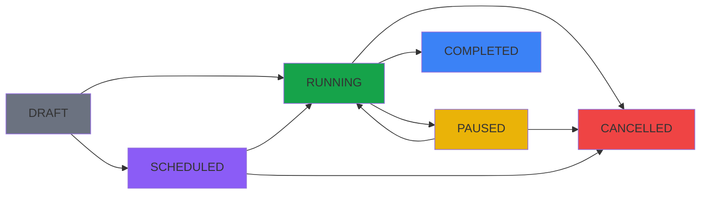
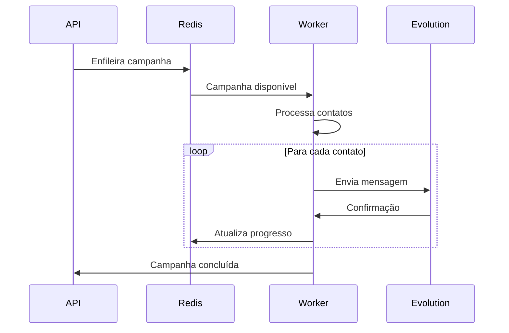

<Note>
Este guia aborda os conceitos fundamentais do Sistema Disparador, explicando a arquitetura, integração com Evolution API, sistema de filas, e principais funcionalidades.
</Note>

## Visão Geral da Arquitetura

O Sistema Disparador é construído sobre uma arquitetura robusta e escalável:

<CardGroup cols={3}>
  <Card title="Spring Boot" icon="server" color="#16a34a">
    Backend Java com APIs REST
  </Card>
  <Card title="PostgreSQL" icon="database" color="#336791">
    Banco de dados relacional
  </Card>
  <Card title="Redis" icon="database" color="#dc2626">
    Sistema de filas e cache
  </Card>
</CardGroup>

### Stack Tecnológica

#### Backend
- **Java 17** com Spring Boot 3.x
- **Spring Security** para autenticação
- **Spring Data JPA** para persistência
- **Spring Actuator** para monitoramento
- **Lombok** para redução de boilerplate
- **Jackson** para serialização JSON

#### Frontend
- **React 18** com TypeScript
- **Vite** como build tool
- **Tailwind CSS** para estilização
- **React Query** para gerenciamento de estado
- **React Router** para navegação
- **React Hot Toast** para notificações

#### Infraestrutura
- **Docker** para containerização
- **Kubernetes** ready
- **GitHub Actions** para CI/CD
- **Evolution API** para WhatsApp

## Evolution API

A **Evolution API** é o motor de comunicação WhatsApp do sistema:

### Funcionalidades Principais

<CardGroup cols={2}>
  <Card title="Multi-Instância" icon="layers" color="#16a34a">
    Suporte a múltiplas contas WhatsApp simultâneas
  </Card>
  <Card title="Tipos de Mensagem" icon="message-square" color="#2563eb">
    Texto, imagem, vídeo, documento e enquetes
  </Card>
  <Card title="QR Code" icon="qrcode" color="#7c3aed">
    Conexão fácil via QR Code no frontend
  </Card>
  <Card title="Webhooks" icon="webhook" color="#ea580c">
    Callbacks para status de mensagens
  </Card>
</CardGroup>

### Configuração por Empresa

Cada empresa pode configurar múltiplas instâncias Evolution:

```typescript
interface EvolutionConfig {
  id: number;
  name: string;
  url: string;          // URL da Evolution API
  apiKey: string;       // Chave de autenticação
  instanceName: string; // Nome da instância
  isActive: boolean;    // Status de ativação
  isConnected: boolean; // Status de conexão
}
```

## Sistema de Campanhas

### Tipos de Campanha

<Tabs>
  <Tab title="Imediata">
    ```json
    {
      "name": "Promoção Flash",
      "message": "Olá {PrimeiroNome}! Aproveite 50% OFF hoje!",
      "contacts": [...],
      "evolutionUrl": "https://api.evolution.com",
      "evolutionApiKey": "sua-chave",
      "evolutionInstance": "vendas"
    }
    ```
  </Tab>
  <Tab title="Agendada">
    ```json
    {
      "name": "Lembrete Evento",
      "message": "{PrimeiroNome}, não esqueça do evento amanhã!",
      "scheduledFor": "2024-01-20T09:00:00",
      "contacts": [...],
      "evolutionUrl": "https://api.evolution.com",
      "evolutionApiKey": "sua-chave",
      "evolutionInstance": "eventos"
    }
    ```
  </Tab>
  <Tab title="Com Mídia">
    ```json
    {
      "name": "Catálogo Produtos",
      "mediaUrl": "https://exemplo.com/catalogo.pdf",
      "mediaType": "document",
      "fileName": "catalogo-2024.pdf",
      "caption": "Confira nossos produtos!",
      "contacts": [...],
      "evolutionUrl": "https://api.evolution.com",
      "evolutionApiKey": "sua-chave",
      "evolutionInstance": "marketing"
    }
    ```
  </Tab>
  <Tab title="Enquete">
    ```json
    {
      "name": "Pesquisa Satisfação",
      "pollData": {
        "name": "Como foi sua experiência?",
        "selectableCount": 1,
        "options": ["Excelente", "Boa", "Regular", "Ruim"]
      },
      "contacts": [...],
      "evolutionUrl": "https://api.evolution.com",
      "evolutionApiKey": "sua-chave",
      "evolutionInstance": "pesquisa"
    }
    ```
  </Tab>
</Tabs>

### Estados da Campanha



<CardGroup cols={3}>
  <Card title="DRAFT" icon="file-text" color="#6b7280">
    Rascunho salvado
  </Card>
  <Card title="SCHEDULED" icon="clock" color="#8b5cf6">
    Agendada para futuro
  </Card>
  <Card title="RUNNING" icon="play" color="#16a34a">
    Enviando ativamente
  </Card>
  <Card title="PAUSED" icon="pause" color="#eab308">
    Pausada temporariamente
  </Card>
  <Card title="COMPLETED" icon="check" color="#3b82f6">
    Finalizada com sucesso
  </Card>
  <Card title="CANCELLED" icon="x" color="#ef4444">
    Cancelada permanentemente
  </Card>
</CardGroup>

## Sistema de Filas

### Arquitetura de Processamento

<Info>
O sistema usa Redis como broker de mensagens para processar campanhas de forma assíncrona e escalável.
</Info>



### Benefícios

1. **Escalabilidade**: Múltiplos workers podem processar em paralelo
2. **Resiliência**: Falhas são tratadas com retry automático
3. **Performance**: Processamento assíncrono não bloqueia API
4. **Controle**: Intervalos configuráveis entre mensagens

## Autenticação e Segurança

### Sistema de Tokens

<Warning>
Tokens não expiram automaticamente. Revogue manualmente se necessário.
</Warning>

```typescript
interface AuthResponse {
  accessToken: string;
  tokenType: "Bearer";
  companyId: number;
  companyName: string;
  companyEmail: string;
  blockedContactsEnabled: boolean;
  pollCampaignsEnabled: boolean;
  expiresAt: null; // Tokens não expiram
}
```

### Níveis de Acesso

<CardGroup cols={3}>
  <Card title="Usuário" icon="user" color="#3b82f6">
    Acesso às funcionalidades básicas
  </Card>
  <Card title="Admin Empresa" icon="building" color="#8b5cf6">
    Configurações da empresa
  </Card>
  <Card title="Super Admin" icon="shield" color="#eab308">
    Acesso total ao sistema
  </Card>
</CardGroup>

## Contatos Bloqueados

### Sistema de Bloqueio Inteligente

<Note>
Contatos bloqueados são automaticamente excluídos de todas as campanhas futuras.
</Note>

#### Funcionalidades

- **Bloqueio Individual**: Via API ou interface
- **Importação em Massa**: Até 10.000 números por vez
- **Verificação Automática**: Durante criação de campanhas
- **Histórico**: Registro de quem e quando bloqueou

#### Estrutura

```typescript
interface BlockedContact {
  id: number;
  companyId: number;
  phoneNumber: string;
  reason?: string;
  blockedBy: string;
  blockedAt: Date;
  isActive: boolean;
}
```

## Integração com Bancos de Dados

### Fontes de Contatos Dinâmicas

O sistema permite integração com bancos externos para buscar contatos:

<CardGroup cols={2}>
  <Card title="PostgreSQL" icon="database" color="#336791">
    Suporte nativo otimizado
  </Card>
  <Card title="MySQL" icon="database" color="#4479a1">
    Compatibilidade total
  </Card>
  <Card title="SQL Server" icon="database" color="#cc2927">
    Via JDBC driver
  </Card>
  <Card title="Oracle" icon="database" color="#f80000">
    Empresas enterprise
  </Card>
</CardGroup>

### Query Builder

Sistema visual para construir queries sem escrever SQL:

1. **Seleção de Tabelas**: Interface intuitiva
2. **Filtros Visuais**: Arraste e solte condições
3. **Preview**: Visualize contatos antes de enviar
4. **Variáveis**: Mapeie colunas para personalização

## Monitoramento e Métricas

### Dashboard em Tempo Real

<Info>
O dashboard é atualizado manualmente sob demanda para economizar recursos.
</Info>

#### Métricas Principais

- **Campanhas Ativas**: Em execução no momento
- **Campanhas Agendadas**: Programadas para futuro
- **Total de Mensagens**: Contador acumulativo
- **Taxa de Sucesso**: Percentual de entrega

### Health Checks

Endpoints do Spring Actuator:

```bash
GET /actuator/health
GET /actuator/info
```

Monitora:
- Status da aplicação
- Conexão com banco de dados
- Disponibilidade do Redis
- Memória e CPU

## Rate Limiting

### Proteção contra Sobrecarga

<Warning>
Limites são aplicados por empresa para garantir fair use.
</Warning>

#### Limites Padrão

- **Requisições API**: 100/minuto por empresa
- **Criação de Campanhas**: 10/hora
- **Mensagens WhatsApp**: Baseado na Evolution API
- **Importação de Contatos**: 10.000 por vez

## Webhooks e Notificações

### Sistema de Callbacks

Configure webhooks para receber eventos:

```json
{
  "event": "campaign.completed",
  "campaignId": 123,
  "companyId": 456,
  "stats": {
    "sent": 1000,
    "failed": 5,
    "duration": "00:15:32"
  }
}
```

### Notificações WhatsApp

Receba avisos no WhatsApp:
- Campanha concluída
- Erros críticos
- Instância desconectada

## Boas Práticas

<CardGroup cols={2}>
  <Card title="Intervalos" icon="clock" color="#16a34a">
    Use 10-30 segundos entre mensagens para evitar bloqueios
  </Card>
  <Card title="Horários" icon="calendar" color="#3b82f6">
    Respeite horário comercial (8h-20h)
  </Card>
  <Card title="Conteúdo" icon="file-text" color="#8b5cf6">
    Evite spam e mensagens repetitivas
  </Card>
  <Card title="Testes" icon="flask" color="#eab308">
    Sempre teste com poucos contatos primeiro
  </Card>
</CardGroup>

## Próximos Passos

<CardGroup cols={3}>
  <Card title="Quickstart" icon="rocket" href="/quickstart">
    Comece em 5 minutos
  </Card>
  <Card title="API Reference" icon="code" href="/api-reference">
    Documentação completa
  </Card>
  <Card title="Troubleshooting" icon="wrench" href="/troubleshooting">
    Resolva problemas comuns
  </Card>
</CardGroup> 

## Automações por Segmentação

As Automações permitem disparos recorrentes baseados em filtros de banco (QueryTemplate) e mensagens personalizadas. Foram projetadas para isolamento total dos fluxos de campanhas.

- Isolamento: filas Redis e workers dedicados (`automation_message_queue`, `automation_scheduled_queue`, `automation_retry_queue`).
- Entidades: `Automation`, `AutomationRun`, `AutomationSentLog` (deduplicação).
- Deduplicação:
  - NEVER: sem filtro de históricos.
  - ONCE: envia uma única vez por contato enquanto a automação existir.
  - COOLDOWN_DAYS: evita reenvios a um contato dentro de uma janela de X dias.
- Limite por execução: `sendLimitPerRun` para restringir o volume por run.
- Agendamento: `DAILY`, `WEEKLY`, `MONTHLY`, `CRON` com `timeOfDay` e `timezone`.
- Mensagens: suporte a `TEXT`, `MEDIA`, `AUDIO` e `POLL` (enquetes).
- Personalização: variáveis padrão e customizadas provenientes do resultado da query, através do mesmo mecanismo das campanhas.
- Teste unitário: endpoint específico para envio isolado, sem criação de run, útil para validação rápida da mensagem. 