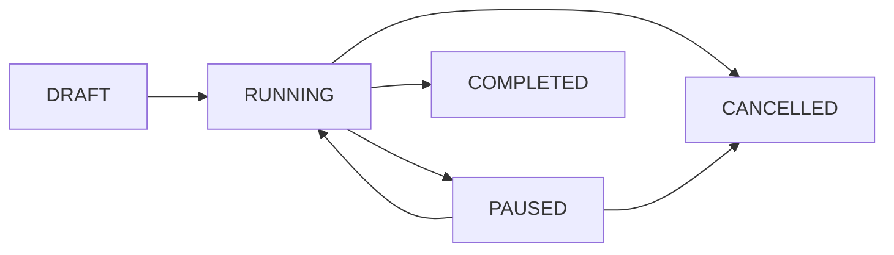
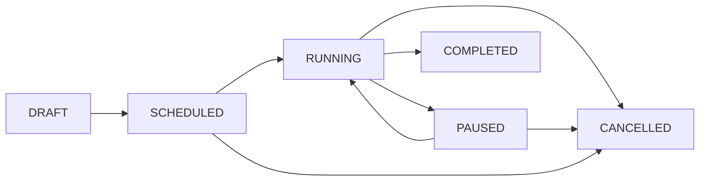

<Note>
Esta página descreve todos os status e tipos possíveis para campanhas na API Disparador, incluindo transições válidas e comportamentos esperados.
</Note>

## Status de Campanha

As campanhas possuem 6 status diferentes que representam seu ciclo de vida:

<CardGroup cols={2}>
  <Card title="DRAFT" icon="file-edit" color="#6b7280">
    **Rascunho** - Campanha criada mas ainda não executada
  </Card>
  <Card title="SCHEDULED" icon="calendar" color="#2563eb">
    **Agendada** - Campanha programada para execução futura
  </Card>
  <Card title="RUNNING" icon="play-circle" color="#16a34a">
    **Executando** - Campanha em execução ativa
  </Card>
  <Card title="PAUSED" icon="pause-circle" color="#d97706">
    **Pausada** - Campanha temporariamente pausada
  </Card>
  <Card title="COMPLETED" icon="check-circle" color="#7c3aed">
    **Concluída** - Campanha finalizada com sucesso
  </Card>
  <Card title="CANCELLED" icon="x-circle" color="#dc2626">
    **Cancelada** - Campanha interrompida permanentemente
  </Card>
</CardGroup>

## Tipos de Campanha

As campanhas podem ser de 2 tipos distintos:

<CardGroup cols={2}>
  <Card title="IMMEDIATE" icon="zap" color="#16a34a">
    **Imediata** - Execução começou imediatamente após criação
  </Card>
  <Card title="SCHEDULED" icon="clock" color="#2563eb">
    **Agendada** - Execução programada para data/hora específica
  </Card>
</CardGroup>

## Fluxo de Status

### Campanha Imediata (IMMEDIATE)



1. **DRAFT** → **RUNNING**: Quando criada sem agendamento
2. **RUNNING** → **PAUSED**: Quando pausada pelo usuário
3. **PAUSED** → **RUNNING**: Quando retomada (até 24h)
4. **RUNNING** → **COMPLETED**: Quando todas as mensagens são enviadas
5. **RUNNING/PAUSED** → **CANCELLED**: Quando cancelada pelo usuário

### Campanha Agendada (SCHEDULED)



1. **DRAFT** → **SCHEDULED**: Quando criada com agendamento futuro
2. **SCHEDULED** → **RUNNING**: Quando chega o horário agendado
3. **RUNNING** → **PAUSED**: Quando pausada pelo usuário
4. **PAUSED** → **RUNNING**: Quando retomada (até 24h)
5. **RUNNING** → **COMPLETED**: Quando todas as mensagens são enviadas
6. **SCHEDULED/RUNNING/PAUSED** → **CANCELLED**: Quando cancelada

## Regras de Transição

### ✅ Transições Permitidas

| Status Atual | Status Destino | Ação Requerida | Condições |
|--------------|----------------|----------------|-----------|
| DRAFT | RUNNING | Criar campanha | Sem agendamento |
| DRAFT | SCHEDULED | Criar campanha | Com agendamento futuro |
| SCHEDULED | RUNNING | Automático | Horário agendado chegou |
| SCHEDULED | CANCELLED | Cancelar | A qualquer momento |
| RUNNING | PAUSED | Pausar | A qualquer momento |
| RUNNING | COMPLETED | Automático | Todas mensagens enviadas |
| RUNNING | CANCELLED | Cancelar | A qualquer momento |
| PAUSED | RUNNING | Retomar | Dentro de 24 horas |
| PAUSED | CANCELLED | Cancelar | A qualquer momento |

### ❌ Transições Não Permitidas

| Status Atual | Status Destino | Motivo |
|--------------|----------------|---------|
| COMPLETED | Qualquer outro | Campanha já finalizada |
| CANCELLED | Qualquer outro | Campanha foi cancelada |
| PAUSED | RUNNING | Mais de 24h pausada |

## Comportamentos por Status

### DRAFT
<div className="info-box">
  <div className="info-title">Comportamento</div>
  Status inicial quando a campanha é criada. A campanha ainda não está ativa e pode ser modificada.
</div>

**Características:**
- Nenhuma mensagem foi enviada
- Configurações podem ser alteradas
- Contatos podem ser adicionados/removidos
- Pode ser iniciada ou agendada

### SCHEDULED
<div className="info-box">
  <div className="info-title">Comportamento</div>
  Campanha aguardando o horário programado para iniciar a execução.
</div>

**Características:**
- Horário de execução definido no futuro
- Aguardando trigger automático do scheduler
- Pode ser cancelada antes da execução
- Configurações ficam bloqueadas para alteração

### RUNNING
<div className="success-box">
  <div className="success-title">Comportamento</div>
  Campanha executando ativamente o envio de mensagens.
</div>

**Características:**
- Worker processando contatos da fila
- Mensagens sendo enviadas conforme intervalo configurado
- Progresso atualizando em tempo real
- Pode ser pausada ou cancelada

### PAUSED
<div className="warning-box">
  <div className="warning-title">Comportamento</div>
  Campanha temporariamente suspensa. Pode ser retomada em até 24 horas.
</div>

**Características:**
- Envio de mensagens interrompido
- Progresso preservado
- Limite de 24 horas para retomada
- Após 24h, só pode ser cancelada

### COMPLETED
<div className="success-box">
  <div className="success-title">Comportamento</div>
  Campanha finalizada com sucesso. Todas as mensagens foram processadas.
</div>

**Características:**
- 100% dos contatos processados
- Estatísticas finais disponíveis
- Notificação de conclusão enviada (se configurada)
- Status final imutável

### CANCELLED
<div className="warning-box">
  <div className="warning-title">Comportamento</div>
  Campanha cancelada permanentemente. Não pode ser retomada.
</div>

**Características:**
- Envio interrompido definitivamente
- Progresso preservado até o momento do cancelamento
- Estatísticas parciais disponíveis
- Status final imutável

## Validações da API

### Endpoint: Pausar Campanha
```http
PUT /api/campaigns/{id}/pause
```

**Validações:**
- Status deve ser `RUNNING`
- Campanha deve pertencer à empresa autenticada
- Não pode estar há mais de 24h pausada anteriormente

### Endpoint: Retomar Campanha
```http
PUT /api/campaigns/{id}/resume
```

**Validações:**
- Status deve ser `PAUSED`
- Não pode ter mais de 24 horas pausada
- Campanha deve pertencer à empresa autenticada

### Endpoint: Cancelar Campanha
```http
PUT /api/campaigns/{id}/cancel
```

**Validações:**
- Status NÃO pode ser `COMPLETED` ou `CANCELLED`
- Campanha deve pertencer à empresa autenticada

## Códigos de Exemplo

### Verificar Status de Campanha

<RequestExample>

```bash cURL
curl -X GET https://{url-key}/api/campaigns/123 \
  -H "X-Access-Token: {access_token}"
```

```javascript JavaScript
const response = await fetch('https://{url-key}/api/campaigns/123', {
  headers: {
    'X-Access-Token': 'your-access-token'
  }
});

const campaign = await response.json();
console.log('Status:', campaign.status);
console.log('Tipo:', campaign.type);
```

```python Python
import requests

headers = {'X-Access-Token': 'your-access-token'}
response = requests.get('https://{url-key}/api/campaigns/123', headers=headers)

campaign = response.json()
print(f"Status: {campaign['status']}")
print(f"Tipo: {campaign['type']}")
```

</RequestExample>

### Lógica de Status em Frontend

<RequestExample>

```javascript Status Display
function getStatusDisplay(status) {
  const statusConfig = {
    'DRAFT': { label: 'Rascunho', color: 'gray', icon: '📝' },
    'SCHEDULED': { label: 'Agendada', color: 'blue', icon: '📅' },
    'RUNNING': { label: 'Executando', color: 'green', icon: '▶️' },
    'PAUSED': { label: 'Pausada', color: 'yellow', icon: '⏸️' },
    'COMPLETED': { label: 'Concluída', color: 'purple', icon: '✅' },
    'CANCELLED': { label: 'Cancelada', color: 'red', icon: '❌' }
  };
  
  return statusConfig[status] || { label: 'Desconhecido', color: 'gray', icon: '❓' };
}

// Verificar se ações são permitidas
function canPause(status) {
  return status === 'RUNNING';
}

function canResume(status, pausedAt) {
  if (status !== 'PAUSED') return false;
  
  const pausedTime = new Date(pausedAt);
  const now = new Date();
  const hoursDiff = (now - pausedTime) / (1000 * 60 * 60);
  
  return hoursDiff < 24;
}

function canCancel(status) {
  return !['COMPLETED', 'CANCELLED'].includes(status);
}
```

</RequestExample>

## Próximos Passos

<CardGroup cols={3}>
  <Card title="Criar Campanha" icon="plus" href="/api-reference/campaigns/create">
    Como criar uma nova campanha
  </Card>
  <Card title="Gerenciar Status" icon="settings" href="/api-reference/campaigns">
    Operações de status disponíveis
  </Card>
  <Card title="Monitoramento" icon="chart-bar" href="/monitoring">
    Monitore campanhas em tempo real
  </Card>
</CardGroup>