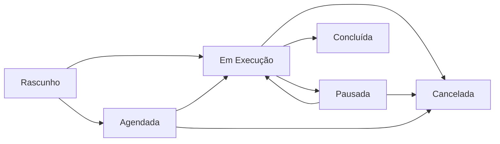

## Visão Geral

A página de Campanhas é o centro de controle para gerenciar todos os disparos de mensagens, com interface intuitiva e recursos avançados.

<Note>
  A interface se adapta automaticamente ao tema claro/escuro e é totalmente responsiva para diferentes dispositivos.
</Note>

## Interface Principal

### Cabeçalho

A página apresenta:
- **Título e Descrição**: "Campanhas - Gerencie suas campanhas de mensagens"
- **Botão Atualizar**: Recarrega a lista de campanhas
- **Botão Nova Campanha**: Abre o modal de criação

### Filtros da Lista

<Info>
  Logo abaixo do cabeçalho, há filtros para refinar a listagem.
</Info>

- **Status**: dropdown com os estados (Rascunho, Agendada, Em Execução, Pausada, Concluída, Cancelada, Erro)
- **Tipo**: WhatsApp, E-mail ou Todos

## Lista de Campanhas

### Colunas da Tabela

<Tabs>
  <Tab title="Desktop">
    A tabela exibe todas as colunas lado a lado:
    1. **Campanha** - Nome e instância Evolution
    2. **Status** - Badge colorido com estado atual
    3. **Progresso** - Barra visual e números (enviados/total)
    4. **Agendamento** - Data/hora programada (se aplicável)
    5. **Ações** - Botões de ação contextuais
  </Tab>
  <Tab title="Mobile">
    Layout em cards com informações essenciais:
    - Nome da campanha em destaque
    - Status e progresso visíveis
    - Menu de ações simplificado
  </Tab>
</Tabs>

### Status e Cores

Cada status possui uma cor e estilo específico:

| Status | Cor | Significado |
|--------|-----|-------------|
| Rascunho | Cinza | Campanha criada mas não iniciada |
| Agendada | Roxo | Programada para execução futura |
| Em Execução | Verde | Ativamente enviando mensagens |
| Pausada | Amarelo | Temporariamente interrompida |
| Concluída | Azul | Finalizada com sucesso |
| Cancelada | Vermelho | Interrompida permanentemente |
| Erro | Vermelho | Falha na execução |

### Barra de Progresso

A barra de progresso mostra:
- **Números**: `enviados/total` (ex: 150/500)
- **Percentual**: Calculado automaticamente
- **Visual**: Barra azul preenchida proporcionalmente
- **Animação**: Transição suave ao atualizar

## Ações Disponíveis

### Por Status da Campanha

<CardGroup cols={2}>
  <Card title="Em Execução" icon="play" color="#16a34a">
    - **Ver Detalhes** 👁️
    - **Pausar** ⏸️
    - **Cancelar** ❌
    - **Duplicar** 📄
  </Card>
  <Card title="Pausada" icon="pause" color="#eab308">
    - **Ver Detalhes** 👁️
    - **Retomar** ▶️
    - **Cancelar** ❌
    - **Duplicar** 📄
  </Card>
  <Card title="Agendada" icon="clock" color="#8b5cf6">
    - **Ver Detalhes** 👁️
    - **Cancelar** ❌
    - **Duplicar** 📄
  </Card>
  <Card title="Finalizada" icon="check" color="#3b82f6">
    - **Ver Detalhes** 👁️
    - **Duplicar** 📄
  </Card>
</CardGroup>

### Descrição das Ações

- **Ver Detalhes** 👁️ - Abre modal com informações completas (WhatsApp e E-mail)
- **Pausar** ⏸️ - Interrompe temporariamente o envio
- **Retomar** ▶️ - Continua do ponto onde parou
- **Cancelar** ❌ - Interrompe permanentemente
- **Duplicar** 📄 - Cria uma cópia em rascunho da campanha

## Modal de Nova Campanha

### Seções do Formulário

<Tabs>
  <Tab title="Dados Básicos">
    - **Nome da Campanha** - Identificação única
    - **Fonte de Dados** - Banco do sistema ou **Meus Bancos** (do usuário)
    - **Instância WhatsApp** - Evolution para envio (se WhatsApp)
  </Tab>
  <Tab title="Filtros">
    - **Filtros Dinâmicos** - De acordo com o template do banco
    - **Operadores** - Igual, Maior que, Menor que, Entre, Contém, IN, etc.
    - **Datas Dinâmicas** - Suporte a HOJE, AMANHA, ONTEM
    - **Ignorar ano** - Para datas como aniversários (compara MM-DD)
    - **Prévia de Contatos** - Visualize e selecione contatos
  </Tab>
  <Tab title="Mensagem">
    - **Tipo** - Texto, mídia ou enquete
    - **Conteúdo** - Editor com variáveis
    - **Mídia** - Upload de imagem/vídeo/documento
    - **Enquete** - Configuração de opções
  </Tab>
  <Tab title="Configurações">
    - **Intervalo de envio** - Aleatório entre 5 e 12 segundos (fixo)
    - **Agendamento** - Data/hora de início (opcional)
    - **Notificação** - Número para receber alertas (opcional)
    - **Modo Teste** - Envia para pequena amostra
  </Tab>
</Tabs>

### Variáveis de Personalização

Use variáveis para personalizar mensagens:
- `{PrimeiroNome}` - Primeiro nome do contato
- `{NomeCompleto}` - Nome completo do contato
- Campos customizados do banco de dados

<CardGroup cols={3}>
  <Card title="Filtros e Operadores" icon="filter" href="/frontend/campaigns/filters">
    Guia completo de filtros
  </Card>
  <Card title="Prévia de Contatos" icon="users" href="/frontend/campaigns/contacts-preview">
    Como revisar e selecionar
  </Card>
  <Card title="Meus Bancos" icon="database" href="/frontend/user-databases">
    Bases próprias do usuário
  </Card>
</CardGroup>

### Validações

O sistema valida automaticamente:
- ✅ Remove contatos bloqueados
- ✅ Valida formato de números
- ✅ Verifica duplicatas
- ✅ Confirma conexão Evolution API

## Modal de Detalhes

### Informações Exibidas

<Info>
  O modal de detalhes é atualizado em tempo real durante a execução da campanha.
</Info>

#### Cabeçalho
- Nome da campanha
- Badge de status colorido
- Botão de atualização manual

#### Estatísticas
- **Total de Contatos** - Quantidade final após filtros/bloqueios
- **Enviados** - Mensagens entregues com sucesso
- **Falhas** - Erros no envio
- **Progresso** - Percentual e barra visual

#### Configurações
- **Mensagem** - Conteúdo enviado
- **Mídia** - Link se houver anexo
- **Intervalos** - Configuração de tempo
- **Evolution** - Instância utilizada

#### Timestamps
- **Criado em** - Data de criação
- **Agendado para** - Se programada
- **Iniciado em** - Início real
- **Concluído em** - Término

## Estados e Fluxo



## Funcionalidades Especiais

### Atualização em Tempo Real

- Lista atualiza automaticamente ao criar/modificar campanhas
- Progresso atualizado dinamicamente
- Notificações toast para feedback de ações

### Responsividade

A interface se adapta perfeitamente:
- **Desktop**: Tabela completa com todas as colunas
- **Tablet**: Layout adaptado mantendo funcionalidades
- **Mobile**: Cards otimizados para toque

### Dark Mode

Suporte completo a tema escuro:
- Cores ajustadas para contraste ideal
- Badges e botões adaptados
- Transições suaves entre temas

## Mensagens de Feedback

### Sucesso
- ✅ "Campanha criada com sucesso"
- ✅ "Campanha pausada"
- ✅ "Campanha retomada"
- ✅ "Campanha cancelada"
- ✅ "Campanha excluída com sucesso"

### Erro
- ❌ "Erro ao criar campanha"
- ❌ "Erro ao pausar campanha"
- ❌ "Erro ao retomar campanha"
- ❌ "Erro ao cancelar campanha"
- ❌ "Erro ao excluir campanha"

## Confirmações

### Excluir Campanha

Ao excluir, um diálogo de confirmação aparece:
- **Título**: "Excluir Campanha"
- **Mensagem**: "Tem certeza que deseja excluir esta campanha? Esta ação não pode ser desfeita."
- **Botões**: Excluir (vermelho) / Cancelar

## Integração com API

### Endpoints Utilizados

```typescript
// Listar campanhas
GET /api/campaigns?status={status}

// Detalhes da campanha
GET /api/campaigns/{id}

// Criar campanha
POST /api/campaigns

// Pausar campanha
PUT /api/campaigns/{id}/pause

// Retomar campanha
PUT /api/campaigns/{id}/resume

// Cancelar campanha
PUT /api/campaigns/{id}/cancel

// Duplicar campanha
POST /api/campaigns/{id}/duplicate
```

## Dicas de Uso

<CardGroup cols={2}>
  <Card title="Organização" icon="folder" color="#3b82f6">
    Use nomes descritivos e inclua datas para facilitar identificação
  </Card>
  <Card title="Testes" icon="flask" color="#16a34a">
    Sempre teste com poucos contatos antes de campanhas grandes
  </Card>
  <Card title="Intervalo Fixo" icon="clock" color="#8b5cf6">
    O envio usa intervalo aleatório entre 5–12s (não configurável)
  </Card>
  <Card title="Monitoramento" icon="eye" color="#f59e0b">
    Acompanhe o progresso para identificar problemas rapidamente
  </Card>
</CardGroup>

## Limitações Conhecidas

<Warning>
  - Exclusão de campanhas ainda não está implementada no backend e não está disponível na interface
  - O limite de contatos por campanha depende da configuração do servidor
  - Campanhas em execução não podem ser editadas
  - Intervalo de envio não é configurável pelo usuário
</Warning>

## Próximas Funcionalidades

<Note>
  Recursos planejados para futuras versões:
  - Exportação de relatórios
  - Templates de mensagens
  - Análise de performance
  - Campanhas recorrentes
</Note>